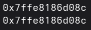

# المحاضرة 1
## المؤشرات
### د. أسامه ناصر
2025-2026
---

```yaml
hideInToc: true
```
# مواضيع الفصل
<div grid="~ cols-2 gap-4">
<div>

- ## المؤشرات
	- ماهي المؤشرات
	- فائدتها
	- العلاقة بين المؤشرات والمصفوفات
	- مخاطر المؤشرات
- ## السجلات وسلاسل الحروف
	- ماهي السجلات
	- تعريفها واستخدامها
	- السلاسل النصية
		- مصفوفات char 
		- الصف string
</div>

<div>

- ## الملفات
	- كيفية التعامل مع الملفات في ++C
	- الملفات التسلسلية والثنائية
	- التنقل ضمن الملفات
	- كتابة السجلات إلى الملفات
- ## الأغراض
	- ماهي الأغراض
	- ماهي البرمجة الغرضية التوجه
	- أسس البرمجة الغرضية التوجه
	- الوراثة
	- تعدد الأشكال
	- التحميل الزائد للعمليات
</div>
</div>
---

```yaml
hideInToc: true
```
# الفهرس
<toc mindepth="1" maxdepth="2"/>

---

# ماهو المؤشر
- المؤشر هو نوع خاص من المتحولات لا يخزن قيمة وإنما يخزن عنوان
- أي أنه يحتوي على مكان تخزين المتحول
- بمعنى آخر هو اللافتة الطرقية التي تخبرنا بمكان تواجد القيمة

---

```yaml
hideInToc: true
```
# ماهو المؤشر
- لا يخزن قيمة تقليدية
- المؤشر يخزن عنوان متحول في الذاكرة
- يستخدم المؤشر في إدارة الذاكرة الديناميكية
---

```yaml
hideInToc: true
```
# ماهو المؤشر
## إدارة الذاكرة الديناميكية
- كي نفهم موضوع الذاكرة الديناميكية علينا أن نفهم الكومة Heap والأقسام Sections
- كأنو عم أحكي سنسكريتي !
- بشكل عام يتم تقسيم الملف التنيفذي إلى جزئين أساسين:
	- الترويسة Header يحتوي معلومات عن الملف التنفيذي يحتاجها نظام التشغيل ليعرف كيف ينفذ الملف
	- المحتوى الذي يتضمن الكود والمتحولات
	- المتحولات ؟؟؟؟؟ مو على أساس المتحول بيتعرف بالذاكرة؟ بلشت تخرف دكتور، لساتك شب !
--- 

```yaml
hideInToc: true
```
# ماهو المؤشر
## إدارة الذاكرة الديناميكية
- لكي نفهم مالمقصود بالمحتوى على أن نفهم تجزئة الملف التنفيذي
- يتم تقسيم محتوى الملف التنفيذي إلى عدة أقسام Sections (في مقرر مبادئ عمل الحواسيب 2 ستتعرفون على مفهوم الجزء Segments وهو النسخة القديمة من القسم Section) 
- للقسم أنواع أهمها: 
	- code يتضمن كود البرنامج المكتوب بلغة الآلة
	- data يتضمن تعريف المتحولات المختلفة
- كيف يعني لم أفهم !
---

```yaml
hideInToc: true
```
# ماهو المؤشر
## إدارة الذاكرة الديناميكية
- لنأخذ المثال التالي: `int x=10`
- في حال قمنا بتحليل الملف التنفيذي فسنجد في قسم data القيمة 10 المذكورة مسبقًا
- أي أن المتحولات العادية التي نعرفها تخزن ضمن الملف التنفيذي وتحمل عند فتح الملف من خلال وضعها في  الذاكرة في جزء خاص يتمضن قيم فقط ولا يتضمن أكواد
- أما الكومة فهي مجال من الذاكرة يمنحه نظام التشغيل للبرنامج كي يحجز ذاكرة جديدة أثناء التنفيذ
- `int *y=new int` 
	- في هذه التعليمة تم تعريف مؤشر جديد اسمه `y` يؤشر على متحول من نوع `int`
	- نلاحظ هنا استخدام الكلمة المفتاحية  `new` التي تعمل على حجز حجرة ذاكرية ضمن الكومة heap، في حالتنا هذه تكون بحجم 4 بايت
	- وضع رمز `*` قبل اسم المتحول أثناء التعريف يحوله لمؤشر
--- 

```yaml
hideInToc: true
```
# ماهو المؤشر
<div grid="~ cols-2 gap-4">
<div>

- لنفهم أكثر سنأخذ الكود التالي:
	- <v-click at="1">تعريف متحول من `int` وتهيئته بالقيمة 10 (يتم تخزين القيمة 10 ضمن الملف التنفيذي)</v-click>
	- <v-click at="2">تعريف المؤشر `y1` مؤشرًا من نوع `int` ويؤشر على المتحول `x`</v-click>
		- <v-click at="2">العمليتان `&` و`*` في المؤشرات مترابطتتان، إذ أن العملية الأولى (التمرير بالمرجع) تعني أعطني عنوان الذاكرة الخاص بالمتحول ويتم تخزينه في حالتنا هذه ضمن المؤشر `y1`</v-click>
	- <v-click at="3">تعريف مؤشر من نوع `int` ديناميكيًا</v-click>
		- <v-click at="4">لن نجد القيمة 10 في قسم  data في الملف التنفيذي</v-click>
</div>
<div>
```cpp {none|2|3|4|5}
int main(){
	int x=10;
	int *y1=&x;
	int *y2=new int;
	*y2=10;
}
```
</div>
</div>
---

# فائدة المؤشرات
- تسمح لنا المؤشرات بإدارة الذاكرة بشكل مباشر
- من خلال عمليات الحجز `new` والتحرير `delete` يمكننا إنشاء وتدمير مؤشرات أثناء تنفيذ البرنامج
---

# أمثلة
## التعريف السهل للمتحولات:
<div grid="~ cols-2">
<div>

- <v-click at="1">قمنا بتعريف المتحول x</v-click>
- <v-click at="2">أسندنا عنوان المتحول x للمؤشر y</v-click>
- <v-click at="3">قمنا بزيادة ما يؤشر عليه y</v-click>
	- <v-click at="4">في التعامل مع المؤشرات، إذا أردنا أن نغير القيمة التي يؤشر عليها المؤشر علينا أن ننفذ ما يعرف باسم `derefrencing` وذلك من خلال استخدام الرمز `*` </v-click>
- <v-click at="5">طباعة النتيجة</v-click>
</div>
<div>

```cpp{none|2|3|4|4|5}
int main(){
	int x=10;
	int *y=&x;
	(*y)++;
	cout<<x<<"\n"<<*y<<endl;
}
```
</div>
</div>
---

```yaml
hideInToc: true
```
# أمثلة
## التعريف السهل للمتحولات:
<div grid="~ cols-3 gap-1">
<div>

- <v-click at="1">تعريف المتحول x</v-click>
- <v-click at="2">تعريف المؤشر y الذي يؤشر على x</v-click>
- <v-click at="3">طباعة عنوان x في الذاكرة</v-click>
- <v-click at="4">طباعة القيمة المخزنة ضمن المؤشر y (وليس ما يؤشر عليه y)</v-click>
</div>
<div>

```cpp{none|2|3|4|5}
int main(){
	int x=10;
	int *y=&x;
	cout<<&x<<endl;
	cout<<y<<endl;
}
```
</div>
<div>

</div>
</div>
---

```yaml
hideInToc: true
```
# أمثلة
## التعريف السهل للمتحولات:
<div grid="~ cols-2 gap-4">

<div>

- ماخرج البرنامج المجاور؟
	- 10
	- <div v-mark.underline.green="1"> قيمة عشوائية</div>
	- خطأ تنفيذ

</div>
<div>
```cpp
int main(){
	int x=10;
	int *y=&x;
	y++;
	cout<<*y<<endl;
}
```
</div>
</div>
---

```yaml
hideInToc: true
```
# أمثلة
## التعريف السهل للمتحولات:
<div grid="~ cols-2 gap-4">

<div>

- لماذا القيمة العشوائية؟
- لأننا في هذه الحالة قمنا بتعديل قيمة المؤشر y وليس ما يؤشر عليه y
- أي أننا غيرنا العنوان الذي يؤشر عليه y
	- يمكننا تغيير العناوين المؤشر عليها!
	- نعم لكن سنعالج هذا الموضوع لاحقًا

</div>
<div>
```cpp
int main(){
	int x=10;
	int *y=&x;
	y++;
	cout<<*y<<endl;
}
```
</div>
</div>
---

# نقاط عامة
- يمكن التصريح عن مؤشر لاي شيء في لغة ++C
- محتوى المؤشر
	- عنوان ذاكرة
	- القيمة 0/NULL والتي تشير إلى اللاشيء
- التعامل مع المؤشرات يعطي قوة كبيرة في إدارة الذاكرة
- لكنه أيضًا يعطي إمكانية أخطاء لها أول ما لها أخر
- العمليتان &و* متعاكستان في المؤشرات
	- & تطعي عنوان متحول
	- * تعطي محتوى القيمة المؤشر عليها
---

# أمثلة إضافية
<div grid="~ cols-2 gap-1">
<div>

```cpp
int main(){
int a=7;
int *aPtr= &a;
cout << "The address of a is " << &a<< "\nThe value of aPtr is " << aPtr;
cout << "\n\nThe value of a is " << a<< "\nThe value of *aPtr is " << *aPtr;
cout << "\n\nShowing that * and & are inverses of "<< "each other.\n&*aPtr = " << &*aPtr
<< "\n*&aPtr = " << *&aPtr << endl;
return 0; }
```
</div>
<div>

- الخرج
```
The address of a is 0x7ffca50da03c
The value of aPtr is 0x7ffca50da03c

The value of a is 7
The value of *aPtr is 7

Showing that * and & are inverses of each other.
&*aPtr = 0x7ffca50da03c
*&aPtr = 0x7ffca50da03c
```
</div>
</div>

---

```yaml
hideInToc: true
```

# أمثلة إضافية
<div grid="~ cols-2 gap-1">
<div>

```cpp{none|2|3|4|5|6}
int main(){
int a=7;
int *aPtr= &a;
cout << "The address of a is " << &a<< "\nThe value of aPtr is " << aPtr;
cout << "\n\nThe value of a is " << a<< "\nThe value of *aPtr is " << *aPtr;
cout << "\n\nShowing that * and & are inverses of "<< "each other.\n&*aPtr = " << &*aPtr<< "\n*&aPtr = " << *&aPtr << endl;
return 0; }
```
</div>
<div>

- <v-click at="1">تعريف المتحول a وإسناد القيمة 7</v-click>
- <v-click at="2">تعريف المؤشر aPtr وإسناد عنوان a إليه</v-click>
- <v-click at="3">طباعة عنوان a وقيمة المؤشر aPtr (نفس القيمة)</v-click>
- <v-click at="4">طباعة قيمة a والمحتوى الذي يؤشر عليه  aPtr</v-click>
- <v-click at="5">aPtr*& تعني خذ عنوان المحتوى الذي يؤشر عليه المؤشر aPtr</v-click>
	- <v-click at="6">aPtr* تعني المحتوى الذي يؤشر عليه aPtr</v-click>
	- <v-click at="7">aPtr*& تعنوي عنوان المحتوى الذي يؤشر عليه aPtr</v-click>
- <v-click at="8">aPtr&* طباعة المحتوى الذي يؤشر عليه عنوان aPtr</v-click>
	- <v-click at="9">aPtr& نتحصل على عنوان المؤشر aPtr (مكان تواجده في الذاكرة أي مؤشر على المؤشر-Pointer Inception) </v-click>
	- <v-click at="10">aPtr&* المحتوى الذي يؤشر عليه العنوان aPtr&</v-click>
</div>
</div>
---

```yaml
hideInToc: true
```
# أمثلة إضافية


<div grid="~ cols-3 gap-1">
<div>

```cpp
int f1(int n){
n=n*n*n;
return n;
}
```

<v-click at="1">

- تمرير بالقيمة
- أي تعديل على القيمة ضمن التابع لا يغير منها خارج التابع
</v-click>
</div>
<div>

```cpp
int f2(int &n){
n=n*n*n;
return n;
}
```

<v-click at="2">

- تمرير بالمرحع
- أي تعديل على القيمة ضمن التابع يغير منها خارج التابع
</v-click>
</div>
<div>

```cpp
int f3(int *n){
*n=*n * *n * *n;
return n;
}
```

<v-click at="3">

- تمرير بالمؤشر
- أي تعديل على القيمة ضمن التابع يغير منها خارج التابع
- في حال غيرنا قيمة المؤشر n (قيمة المؤشر وليس قيمة ما يؤشر عليه) لن يتأثر المتحول الأصلي بأي شيء
</v-click>
</div>
</div>
---

# حجم المؤشر
- ما هو عدد البايتات المطلوب لتخزين عنوان ذاكري؟
	- 4 بايت
	- 8 بايت
	- 16 بايت
	- 2 بايت
<v-click at="1">

- الإجابة تحتاج تفاصيل أكثر
	- <v-click at="2">الموضوع مرتبط بالمعالج ونظام التشغيل</v-click>
	- <v-click at="3"> هنالك حاليًا معالجات 32 بت (في طريقها للاندثار) ومعالجات 64 بت</v-click>
	- <v-click at="4">يعبر هذا الرقم عن عدة نقاط، ابسطها عدد البتات التي يمتلك المعالج القدرة على معالجتها في لحظة واحدة</v-click>
	- <v-click at="5">معالجات 32 بت تعبر عن المؤشر بمتحول بطول 32 بت (4 بايت) بينما جماعة 64 بت تحتاج 8 بايت</v-click>
</v-click>
---

```yaml
hideInToc: true
```
# حجم المؤشر
- طيب ما علاقة نظام التشغيل بالموضوع ؟
	- يمكن تشغيل أنظمة 32 بت على معالجات 64 بت دون أن تستفيد من طاقتها الكاملة
	- في هذه الحالة نظام التشغيل غير قادر على التعامل مع 64 بت ويتعامل فقط مع 32 بت
- نكشة أخيرة، عند ترجمة البرنامج compile في حال حددنا أننا نستهدف 32 بت، فسينتج لدينا تطبيق يعرف المؤشر ب 4 بايت
--- 

```yaml
hideInToc: true
```
# حجم المؤشر
```cpp
int main(){
int a=7;
int *aPtr=&a;
cout<<sizeof(aPtr)<<" Bytes"<<endl;
return 0; }
```

<div grid="~ cols-2 gap-1">
<div>

- أمر الترجمة `g++ p.cpp`
```
8 Bytes
```
</div>
<div>

- أمر الترجمة ` g++ p.cpp -m32`
```
4 Bytes
```
</div>
</div>

- أي أن حجم المؤشر كمتحول مختلف عن بقيمة الأنواع
- هو ليس ثابت وإنما مرتبط بعدة عوامل