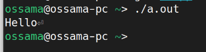

# المحاضرة 5
## الملفات
### د. أسامه ناصر
2025-2026

---

```yaml
hideInToc: true
```
# الفهرس
<toc />

---

# ماهي الملفات؟
- الملفات هي الوحدة الأساسية لتخزين البيانات والمعلومات في الحاسب
- لها أنواع مختلفة مثل:
	- صور: JPG, PNG ,TIFF
	- صوت: MP3, M4A, WAV
	- فيديو: AVI, WMV, 3GP, MP4, MKV, FLV
	- تنفيذي: EXE, DLL, SYS
	- مستندات: DOC, DOCX, XLS, XLSX, PPT, PPTX, PDF
	- ملفات نصية: TXT, INI, YAML, JSON, XML, CPP
	- ملفات مضغوظة: ZIP, RAR, TAR.XZ, TAR.GZ
---

## كيف نميز الملفات عن بعضها؟
- الطريقة الأولى من خلال اللاحقة:
	- لكل ملف عادةً لاحقة extension مكون من حرف واحد فأكثر تلي اسم الملف بعد رمز **.**
		- photo.jpg يشير لصورة من نوع JPEG
		- movie.mp4 ملف فيديو من نوع MP4
		- هذه الطريقة سهلة لكنها ليست مضمونة إذ يمكن أثناء إعادة تسمية الملف تغيير اللاحقة
- الطريقة الثانية: الترويسة
	- لكل ملف غير نصي ترويسة Header تحتوي معلومات تعبر عن محتوى الملف والتفاصيل التي نتوقعها منه
	- تختلف هذه الترويسة من ملف لأخر
		- في صور JPG تحتوي معلومات عن حجم الصورة، مستوى الضغط، تفاصيل الألوان، معطيات فك الضغط
		- في ملف EXE تحتوي معلومات عن توع الملف التنفيذي (32/64)، أجزاء الملف المختلفة (كود + بيانات وغيرها)، معلومات عن التوابع التي يحتاجها البرنامج من نظام التشغيل وملفات أخرى (مكاتب)
	- هذه الطريقة تتطلب آلية تحليل الترويسة لتحديد نوع الملف
---

## تخزين الملفات
- يتم تخزين الملفات ضمن بنية هرمية
- هذه البنية تعتمد بشكل أساسي على المجلدات
	- المجلد وحدة تنظيمية تستخدم لترتيب الملفات والمجلدات الأخرى
	- يتم تخزين المجلدات إما ضمن مجلد فرعي أو رئيسي
		- تختلف المجلدات الرئيسية حسب نظام التشغيل
			- في الأنظمة القائمة على Unix (مثل Linux, MacOS, Android) يتم التخزين ضمن مجلد أساسي يسمى الجذر (Root /)
			- في نظام Windows تعتبر المجلدات الرئيسية أقراص تشير إلى أقراص حقيقية أو أجزاء (Partition) تعبر عن أقراص منطقية
---

## بنية الملفات
- يغض النظر عن نوع الملف الذي يتم التعامل معه أو محتواه
- يمكن النظر لكل ملف في نظام التشغيل على أنه مجموعة من البايتات المتتالية
- أي الملفات عبارة عن مصفوفة من البايتات Array of Bytes
- وفقًا لآلية القراءة
	- يمكننا قراءة الملفات كمجموعة من المحارف مثل القراءة من cin (يسمى ذلك ملفات تسلسلية)
	- قراءة البايتات بشكل مباشر من أي مكان ضمن الملف مثل المصفوفة (يسمى لك ملفات ثنائية\عشوائية)
--- 

# الملفات التسلسلية
- هي آلية في قراءة الملفات ما يتم القراءة من cin والكتابة إلى cout
- القراءة تتم بشكل تسلسلي
	- قراءة السطر 100 تتطلب قراءة 99 سطر قبل الوصول إلى السطر 100
- للتعامل مع الملفات بشكل عام في لغة ++C نحتاج لاستخدام المكتبة fstream
	- إذا كنا نريد القراءة من ملف نستخدم ifstream أو fstream
	- إذا كتا نريد الكتابة إلى ملف نستخدم ofstream أو fstream
	- أثناء التعامل مع الملفات التسلسلية نستخدم عادةً fstream و ofstream
---

## فتح ملف
- لفتح ملف علينا تحديد هل نريد الفتح في وضعية القراءة أم الكتابة
- مسار الملف
<div grid="~ cols-2 gap-1">
<div>

```cpp
#include<iostream>
#include<fstream>
using namespace std;
int main(){
ofstream fileWriter(
"my-file.txt",ios::out);
ifstream fileReader(
"my-file.txt",ios::in);
fileWriter<<"Hello world"<<endl;
string x;
fileReader>>x;
cout<<x;
}
```

</div>
<div>

```
Hello world
```


</div>
</div>

---

```yaml
hideInToc: true
```
## فتح ملف
- تفاصيل إضافية:
	- القيمة الأولى أثناء إنشاء ifstream أو ofstream هي مسار الملف الذي نريد فتحه
	- القيمة الثانية هي حالة عملية الفتح:
		- ios::in نفتح للقراءة  (السلوك الافتراضي في ifstream وبالتالي لسنا بحاجة لإضافته)
		- ios::out نفتح للكتابة (السلوك الافتراضي في ofstream وبالتالي لسنا بحاجة لإضافته)
		- ios::binary ملف ثنائي
		- ios::app إلحاق الخرج بنهاية الملف، في حالة ios::out تتم الكتابة من بداية الملف وبالتالي يتم تغيير المحتوى كاملًا بينما في هذه الحالة يتم الكتابة في نهاية الملف وبالتالي يتم زيادة المحتوى(إكمال كتابة من نهاية التوقف الماضي)
---

## القراءة من ملف
- لنقوم بالقراءة من ملف تسلسلي نلجأ لاستخدام ifstream والتي يتم التعامل معها وكأننا نتعامل مع cin
```cpp
int main(){
ifstream fin("my-file.txt");
if(fin.is_open())
while(!fin.eof())
{ string x;
	fin>>x;
	cout<<x;
}
fin.close();
cout<<fin.is_open();
}
```

- مامعنى eof؟
	- هو تابع يعيد القيمة true في حال وصلنا إلى نهاية الملف
- ما معنى is_open؟
	- تابع يعيد القيمة true إذا كان الملف مفتوحًا من قبل البرنامج

---

```yaml
hideInToc: true
```
## القراءة من ملف
- لنقوم بالقراءة من ملف تسلسلي نلجأ لاستخدام ifstream والتي يتم التعامل معها وكأننا نتعامل مع cin
```cpp
int main(){
ifstream fin("my-file.txt");
if(fin.is_open())
while(!fin.eof())
{ string x;
	fin>>x;
	cout<<x;
}
fin.close();
cout<<fin.is_open();
}
```

- ما معنى close؟
	- تابع يعمل على إغلاق الملف إذا كان مفتوحًا
	- في حال كان البرنامج يفتح عدد من الملفات، لا يحتاجها خلال فترة التشغيل (أي أنه ليس بحاجة لها دائمًا) لا بد من إغلاقها لحظة الانتهاء منها تجنبًَا لأي مشاكل
--- 

# الملفات والسجلات
- لدينا برنامج يهدف لتخزين معلومات الطلاب وفق ما يلي:
	- الرقم الجامعي
	- الاسم الأول
	- الكنية
	- معدل شهادة الثانوية
- التخزين ضمن ملف تسلسلي
- نعبر عن كل طالب بسجل struct وفق ما يلي:
```cpp
struct student{
long id;
string firstName;
string lastName;
float points;
}
```
---

```yaml
hideInToc: true
```
# الملفات والسجلات
- نريد من البرنامج إمكانية إدخال الطالب من لوحة المفاتيح أو من ملف 
- في تم الإدخال من لوحة المفاتيح يجب إضافة الطالب إلى الملف
- قراءة وطبع معلومات كل طالب في الملف