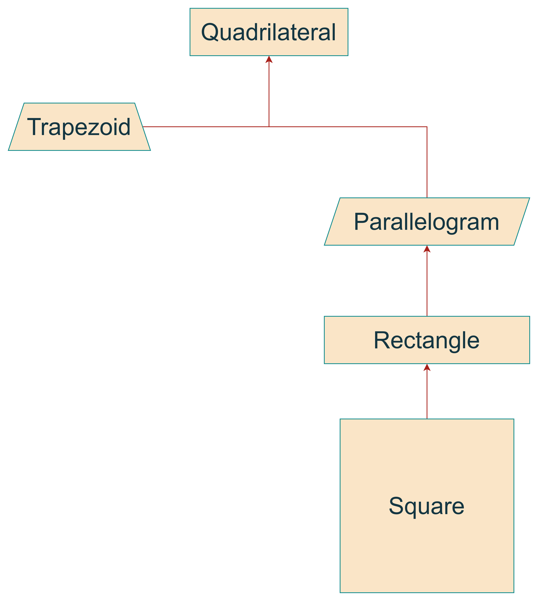
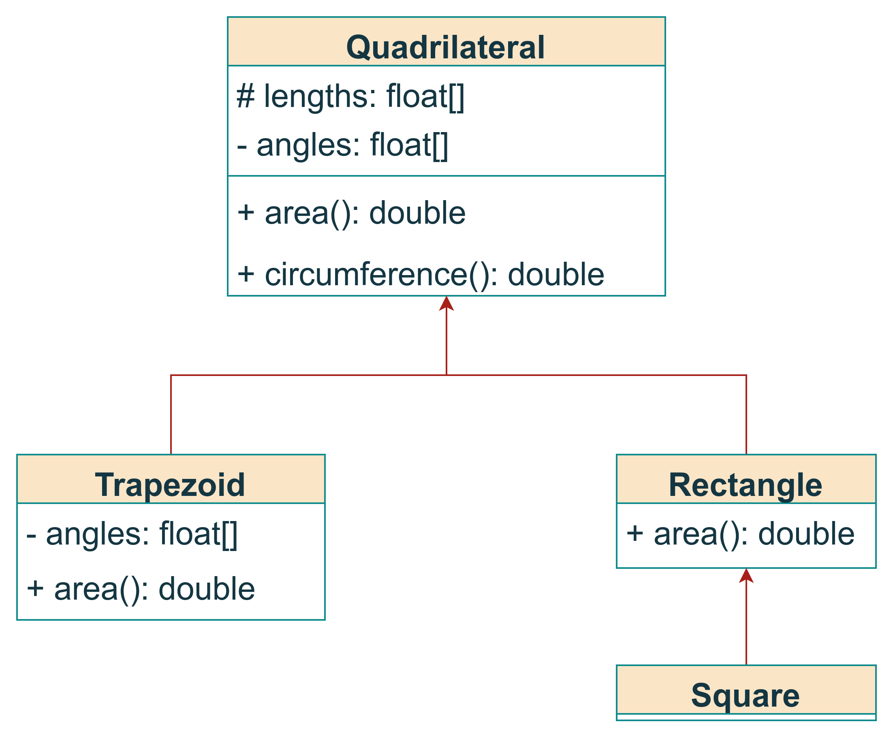

# المحاضرة 9
## الوراثة
### د. أسامه ناصر
2025-2026

---

```yaml
hideInToc: true
```
# الفهرس
<toc />

---

```yaml
hideInToc: true
```
# في الحلقة السابقة
- الأغراض والحقول الساكنة
- التحميل الزائد للعمليات
- الأصدقاء
- الحقول والتوابع الساكنة
---

# ما هي الوراثة
- هي آلية في البرمجة الغرضية التوجه تسمح لنا بإضافة توابع (مهام) وحقول (قيم) جديدة لصف ما دون أن نعدل عليه
- نعمل على زيادة التفاصيل (التخصيص) من خلال توريث الصف الأب لصف ابن
- أي أن الصف الابن يمتلك التفاصيل الخاصة به والتفاصيل الخاصة بالأب
- تسمح لنا الوراثة:
	- استخدام ‬‫ميزات‬ ‫الأب‬
	‫- إضافة‬‫ ميزات‬ ‫جديدة‬ 
	‫- إعادة ‬‫استخدام‬ ‫الكود‬ ‫(تخفيف‬ ‫الكمية‬ ‫المطلوبة‬ ‫من‬ ‫الكود‬ ‫المكتوب)‬
---

# مثال
<div grid="~ cols-2 gap-1">
<div>

- الصف الأساسي هو رباعي الأضلاع Quadrilateral
- تتم وراثته من صفين هما
	-  Parallelogram (متوازي الأضلاع)
	- Trapezoid (شبه المنحرف) 
- هذا يعني أن كل شكل متوازي أضلاع أو شبه منحرف هو شكل رباعي أضلاه (تعميم Generalization)
- ليس بالضرورة أن يكون كل شكل رباعي الأضلاع متوازي أضلاع، قد يكون شبه منحرف
- أي أن كل من شبه المنحرف و متوازي الأضلاع هو حالة خاصة من رباعي الأضلاع (تخصيص Specialization)
</div>
<div>

</div>
</div>

---

```yaml
hideInToc: true
```
# مثال
<div grid="~ cols-2 gap-1">
<div>

- الوراثة علاقة متعدية
	- بما أن المستطيل هو متوازي أضلاع ومتوازي الأضلاع هو شكل رباعي فهذا يعني أن المستطيل شكل رباعي
</div>
<div>

</div>
</div>
---

# بشكل أوضح
<div grid="~ cols-2 gap-1">
<div>

 - تم إزالة متوازي الأضلاع من المخطط لتبسيط الشرح
 - هذا المخطط يسمى مخطط الصفوف Class Diagram
 - مخطط يستخدم للتعبير عن بنية الصفوف ضمن النظام البرمجي والعلاقات بينها
 - سنتسخدمه لإيضاح علاقة الوراثة
- التوابع والحقول تمتلك الرموز التالية
	- `-`  وتشير إلى أن هذا التابع أو حقل خاص private
	- `+` تشير إلى أن هذا التابع أو الحقل عام public
	- `#` تشير إلى أن هذا التابع أو الحقل محمي protected
</div>
<div>

</div>
</div>
---

```yaml
hideInToc: true
```
# بشكل أوضح
<div grid="~ cols-2 gap-1">
<div>


- في حال لدينا الكود التالي:
```cpp
Rectangle b;
b.area()
```

- أي تابع area يجب أن يتم استدعاؤه ؟
	- ***الخاص بـ Rectangle***
	- الخاص بـ Quadrilateral
</div>
<div>

</div>
</div>
---

```yaml
hideInToc: true
```
# بشكل أوضح
<div grid="~ cols-2 gap-1">
<div>


- في حال لدينا الكود التالي:
```cpp
Square b;
b.area()
```

- أي تابع area يجب أن يتم استدعاؤه ؟
	- ***الخاص بـ Rectangle***
	- الخاص بـ Quadrilateral
</div>
<div>

</div>
</div>
---

```yaml
hideInToc: true
```
# بشكل أوضح
<div grid="~ cols-2 gap-1">
<div>

- في حال كتابتنا لتابع ضمن الصف Trapezoid واستخدمنا 
`angles[0]=20`
- هل هذا صحيح ؟ نعم، على الرغم من أن الحقل angles خاص ضمن الصف Quadriltateral إلا أنه تمت إعادة تعريفه ضمن الصف Trapezoid
</div>
<div>

</div>
</div>
---

```yaml
hideInToc: true
```
# بشكل أوضح
<div grid="~ cols-2 gap-1">
<div>

- في حال كتابتنا لتابع ضمن الصف Squre واستخدمنا 
`angles[0]=20`
- هل هذا صحيح ؟ لا، لأن الحقل angles خاص ضمن الصف Quadriltateral وبالتالي لا يمكن رؤيته إلا من داخل الصف Quadriltateral
</div>
<div>

</div>
</div>
---

```yaml
hideInToc: true
```
# بشكل أوضح
<div grid="~ cols-2 gap-1">
<div>

- أي من الأكواد التالية صحيح:
	- `Trapezoid * t=new Square()`
		- غير صحيح، لا توجد أي صلة مباشرة تربط الابن Sqyare بالاب Trapezoid
	-  `Square * s=new Square()`
		- الأمور سليمة
	- `Rectangle * t=new Square()`
		- ﻷن الصف Rectangle هو أب للصف Square يمكن تعميم الصف الـ Square وتمثيله باستخدام الأب Rectangle
	- `Quadrilateral * z=new Trapezoid()`
		- صحيح لنفس السبب
</div>
<div>

</div>
</div>
---

```yaml
hideInToc: true
```
# بشكل أوضح
<div grid="~ cols-2 gap-1">
<div>

- أي من الأكواد التالية صحيح:
	- `Square * s=new Rectangle()`
		- غير صحيح، الصف Rectangle هو أب للصف Square وبالتالي لا يمكن التعميم من الابن إلى الأب
	-  `z=s`
		- صحيح، لأن الصف Quadrilateral هو أب الصف Rectangle الذي هو أب الصف Square وبما أن الوراثة علاقة متعدية، فإن Quadrilateral هو أب الصف Square وبالتالي يمكن التعميم
	- `s=z;`
		- لا يمكن تعميم الأب عن طريق الابن بل يجب التخصيص وذلك عن طريق القسر الصريح
	- `s=(Square*)z`
		- صحيح لتنفيذ عملية قسر صريحة من الأب للابن (تخصيص)
</div>
<div>

</div>
</div>
---

# الوراثة المتعددة
- تدعم لغة ++C الوراثة المتعددة، أي يكون للابن أكثر من أب، إلا أنها تمتلك مشاكل خاصة بها لذلك لن نتطرق لها