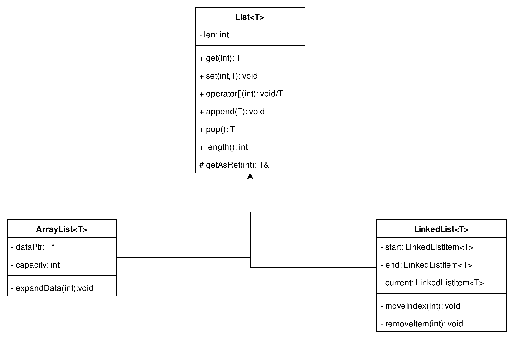
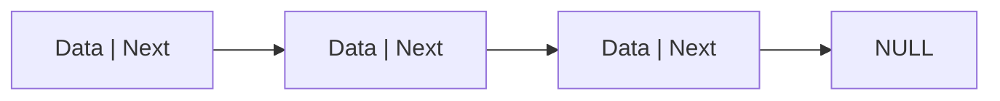
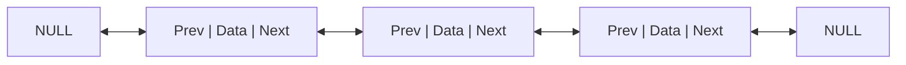
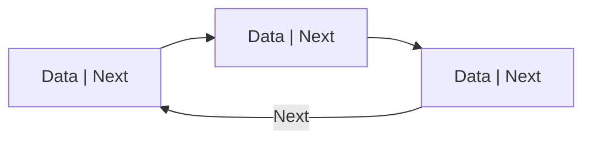

# المحاضرة 10
## الوراثة بالأمثلة
### د. أسامه ناصر
2025-2026
---

```yaml
hideInToc: true
```
# الفهرس
<toc mindepth="1" maxdepth="3" />

---
```yaml
hideInToc: true
```
# في الحلقة السابقة
- تعرفنا على التحميل الزائد للعمليات في الصفوف
- ما أهمية التابع الصديق للتحميل الزائد للعمليات
- مفاهيم أساسية في الوراثة وتعددية الأشكال
- التعميم Generalization والتخصيص Specialization
---

---

# شرح المثال
- سنعمل اليوم على تطوير 3 صفوف
	- List
	- ArrayList
	- LinkedList
- الصفين الثاني والثالث يرثان الصف الأول
---

```yaml
hideInToc: true
```
# شرح المثال
- لتكن لدينا البنية التالية:

---

## بنية الصف List

- الصف List يعبر عن قائمة تخزن أي نوع من العناصر
	- الحقل len يعبر عن طول القائمة (عدد العناصر الموجودة فيها)
	- التابع get يعطي القيمة المخزنة ضمن فهرس
	- التابع set يخزن قيمة ضمن فهرس
	- `operator[]` تحميل زائد للمعامل `[]`
	- التابع append لإضافة عنصر جديد في نهاية القائمة
	- التابع pop لإزالة عنصر من نهاية القائمة
	- التابع length يعطي طول القائمة
	- التابع getAsRef يعيد القيمة المخزنة ضمن فهرس بالمرجع (له استخدام لاحق)
---

```yaml
hideInToc: true
```
# بنية الصف List
```cpp
template <typename T>
class List {
protected:
    int len = 0;
    virtual T& getAsRef(int index) = 0;

public:
    virtual ~List() {}
    virtual T get(int index) = 0;
    virtual void set(int index, T value) = 0;   
    virtual void append(T value) = 0;
    virtual T pop() = 0;
    T& operator[](int index) {return getAsRef(index);}
    int length() const { return len; }
};
```
---

```yaml
hideInToc: true
```
# بنية الصف List
- مالمقصود بـ `template <typename T>`
	- المقصود بها أن القائمة List تتقبل أي نوع بيانات أي أن الأكواد التالية صحيحة:
```cpp
List<int> x;
List<double> y;
List<Class1> z
```

- ماذا يعني virtual؟
	- الترجمة الحرفية افتراضي
	- تعني في سياق البرمجة الغرضية التوجه ما يلي
		- التابع معرف ضمن الأب
		- في حال إعادة تعريفه override ضمن الابن، وعبرنا عن الابن باستخدام الأب نفذ الكود الموجود لدى الابن وليس الكود الموجود لدى الأب
		- في حالتنا هذه لدينا تابع pure virtual (نتيجة إضافة `0=` في النهاية لهذه التابع)، هذا النوع من الصفوف يعرف باسم الصف المجرد abstract والذي لا يمكن بناؤه، يمكن بناء أبنائه بشريطة ألا يكونوا abstract 
- لكي يعمل المعامل `[]` بشكل سليم ليسمح لنا بالقراءة والكتابة يجب أن يعيد قيمة بالمرجع ليسمح بالتغير والتعديل، وهذا سبب استخدام التابع getAsRef عوضًا عن التابع get
--- 

## الصف ArrayList
- يعتمد هذ الصف على المصفوفات لتخزين القيم
- داخليًا يخزن ضمن مصفوفة
	- عند إنشاء المصفوفة أول مرة يحجز مجموعة من الخانات الفارغة
	- عندما تمتلئ هذه الخانات الفارغة يقوم بإنشاء مصفوفة جديدة ذات حجم أكبر وينقل العناصر السابقة لها ويضيف العنصر الجديد في النهاية
	- أي أن capacity تعبر عن السعة الكلية للمصفوفة (عدد الغرف في الفندق)
	- len تعبر عن عدد الخانات المستخدمة (الغرف المحجوزة)
---

```yaml
hideInToc: true
```
## الصف ArrayList
- الحقل capacity يعبر عن السعة الكلية للمصفوفة
- الحقل dataPtr مؤشر على المصفوفة
- التابع exapandData يقوم بزيادة السعة بناءً على القيمة المررة
---

```yaml
hideInToc: true
```
## الصف ArrayList
```cpp
template <typename T>
class ArrayList : public List<T> {
private:
T* dataPtr = nullptr;
int capacity = 0;
void expandData(int newCapacity) {
if (newCapacity <= capacity) return;
int actualNewCapacity = (capacity == 0) ? 2 : capacity * 2;
if (newCapacity > actualNewCapacity) actualNewCapacity = newCapacity;
T* newData = new T[actualNewCapacity]();
for (int i = 0; i < this->len; i++)
newData[i] = dataPtr[i];
delete[] dataPtr;dataPtr = newData;
capacity = actualNewCapacity;}
```
---

```yaml
hideInToc: true
```
## الصف ArrayList
<div grid="~ cols-2 gap-1">
<div>

```cpp
class ArrayList : public List<T>
```
<br/>
<br/>
<br/>
<br/>
<br/>
<br/>
<br/>
```cpp
T* dataPtr = nullptr;
int capacity = 0;
```
</div>
<div>

- نعرف الصف ArrayList على أنه وارث للصف List
	- ما الذي نقصده بالأمر public قبل كلمة List
	- محدد معرفة الوراثة، public تعني أن كل العام يعرف أن الصف ArrayList يرث الصف List، أما في حال استخدمنا private فهذا يعني أن لا أحد يعرف أن الصف ArrayList يرث الصف List وفي حال استخدمنا protected فهذا يعني أن أبناء ArrayList هم وحدهم من يعرفون أن ArrayList يرث الصف List
- تعريف المؤشر dataPtr يؤشر على اللاشي (nullptr = 0)
- تعريف السعة الأولية للمصفوفة =0
	- يمكننا إسناد قيم ابتدائية للحقول عند تعريفها ضمن الصف
</div>
</div>
---

```yaml
hideInToc: true
```
## الصف ArrayList
<div grid="~ cols-2 gap-1">
<div>

```cpp{|2|3|4|5|}
void expandData(int newCapacity) {
if (newCapacity <= capacity) return;
int actualNewCapacity = (capacity == 0) ? 2 : capacity * 2;
if (newCapacity > actualNewCapacity) actualNewCapacity = newCapacity;
T* newData = new T[actualNewCapacity]();

```
</div>
<div>

- <v-click at="1">لا يمكننا المتابعة في حال كانت السعة الجديدة أصغر من السعة القديمة</v-click>
- <v-click at="2">حساب السعة الفعلية (في حال كنا عند أول استدعاء)</v-click>
- <v-click at="3">التحقق من أن السعة الجديدة أكبر من السعة الفعلية</v-click>
- <v-click at="4">بناء المصفوفة</v-click>
</div>
</div>
---

```yaml
hideInToc: true
```
## الصف ArrayList
<div grid="~ cols-2 gap-1">
<div>

```cpp{|1,2|3|4|}
for (int i = 0; i < this->len; i++)
newData[i] = dataPtr[i];
delete[] dataPtr;dataPtr = newData;
capacity = actualNewCapacity;}
```
</div>
<div>

- <v-click at="1">نسخ القيم من المصفوفة القديمة للجديدة</v-click>
- <v-click at="2">حذف المصفوفة القديمة</v-click>
- <v-click at="3">تخزين المصفوفة  الجديدة</v-click>
</div>
</div>
---

```yaml
hideInToc: true
```
## الصف ArrayList
```cpp
protected:
    T& getAsRef(int index) override {
        if (index < 0 || index >= this->len) throw out_of_range("Index out of bounds");
        return dataPtr[index];
    }
```

- التعليمة throw تستخدم لإنشاء نوع خاص من الأخطاء يسمى الاستثناءات (غير مطلوبة)
- في حال كان العنصر الذي نرغب بالوصول له خارج مجال المصفوفة نعطي خطأ
- خلاف ذلك نعيد القيمة
---

```yaml
hideInToc: true
```
## الصف ArrayList
```cpp
public:
    ArrayList() : dataPtr(nullptr), capacity(0) { this->len = 0; }
    ~ArrayList() { delete[] dataPtr; }
T get(int index) override {
        if (index < 0 || index >= this->len) throw out_of_range("Index out of bounds");
        return dataPtr[index];}
void set(int index, T value) override {
        getAsRef(index) = value;}

```
---

```yaml
hideInToc: true
```
## الصف ArrayList
```cpp
void push(T value) override {
        if (this->len >= capacity) expandData(this->len + 1);
        dataPtr[this->len++] = value;}
T pop() override {
        if (this->len == 0) throw runtime_error("Empty list");
        return dataPtr[--this->len];}
```
---

## الصف LinkedList
### مفهوم القوائم المترابطة
على عكس المصفوفات (Arrays)، لا تُخزن القوائم المترابطة العناصر في أماكن متجاورة في الذاكرة. بدلاً من ذلك، تتكون القائمة من وحدات تسمى **العقد (Nodes)**، وكل عقدة ترتبط بالعقدة التي تليها عن طريق "مؤشر" (Pointer/Reference).
### مكونات العقدة (Node)
- تتكون كل عقدة بشكل أساسي من جزئين:
	1. **البيانات (Data):** القيمة المراد تخزينها (رقم، نص، كائن، إلخ).
    2. **المؤشر (Next):** عنوان الذاكرة للعقدة التالية في القائمة. (يجب أن يتواجد هذا المؤشر على الأقل)
---

```yaml
hideInToc: true
```
## الصف LinkedList
### أنواع القوائم المترابطة

توجد عدة أشكال للقوائم المترابطة بناءً على طريقة الربط بين العقد:

1. **القائمة المترابطة الأحادية (Singly Linked List):**
    - كل عقدة تشير إلى العقدة التي تليها فقط.
    - آخر عقدة تشير إلى `NULL`.
    - التنقل باتجاه واحد فقط
2. **القائمة المترابطة المزدوجة (Doubly Linked List):**
	- كل عقدة تحتوي على مؤشرين: واحد للعقدة التالية وآخر للعقدة السابقة.
    - تسمح بالتنقل في القائمة للأمام والخلف.
    - مؤشر السابق في العقدة الأولى يشير إلى `NULL`
    - مؤشر التالي في العقدة الأخيرة يشير إلى `NULL`
3. **القائمة المترابطة الدائرية (Circular Linked List):**
    - تشير العقدة الأخيرة فيها إلى العقدة الأولى بدلاً من `NULL` مما يشكل حلقة مغلقة.
---

```yaml
hideInToc: true
```

## الصف LinkedList
- القائمة الأحادية


- القائمة المترابطة المزودجة


- القائمة المترابطة الدائرية

---

```yaml
hideInToc: true
```
## الصف LinkedList
### العمليات الأساسية
تتميز القوائم المترابطة بمرونة عالية في تنفيذ العمليات التالية:

- **الإدراج (Insertion):** يمكن إضافة عقدة في البداية، النهاية، أو في أي مكان بالمنتصف بمجرد تغيير وجهة المؤشرات، دون الحاجة لإعادة ترتيب العناصر الأخرى كما في المصفوفات.
    
- **الحذف (Deletion):** يمكن إزالة عقدة عن طريق جعل العقدة التي تسبقها تشير مباشرة إلى العقدة التي تليها.
    
- **البحث (Search):** يتطلب المرور على العقد واحدة تلو الأخرى بدءاً من الرأس (Head).
    
- **المرور (Traversal):** زيارة كل عقدة في القائمة لطباعة البيانات أو معالجتها.
---

```yaml
hideInToc: true
```
## الصف LinkedList
- يتوجب علينا أولًا تعريف العقد بالاعتماد على Structs
```cpp
template <typename T>
struct LinkedListItem {
    T data;
    LinkedListItem* next;
    LinkedListItem* prev;
};
```
---

```yaml
hideInToc: true
```
## الصف LinkedList
- يتوجب علينا أولًا تعريف العقد بالاعتماد على Structs
```cpp
template <typename T>
class LinkedList : public List<T> {
private:
    LinkedListItem<T>* start = nullptr;
    LinkedListItem<T>* end = nullptr;
    LinkedListItem<T>* current = nullptr;

    void moveIndex(int index) const {
        if (index < 0 || index >= this->len) throw out_of_range("Index out of bounds");
        current = start;
        for (int i = 0; i < index; i++) {
            current = current->next;
        }
    }
```
---

```yaml
hideInToc: true
```
## الصف LinkedList
- لكي نتقل (باسهل شكل ممكن)
	- ننفذ حلقة تنتقل من البداية إلى العنصر المطلوب وذلك من خلال قراءة محتوى الحقل next في العقدة (LinkedListItem)
- هل هنالك آليات تنقل أخرى؟
	- نعم تستوجب تخزين معلومات أكثر ولكنا تسمح بالتنقل بين العناصر بالاعتماد على next وprev
	- وذلك بناءً على الفهرس الحالي والفهرس الهدف
	- (غير مطلوب)
---

```yaml
hideInToc: true
```
## الصف LinkedList
```cpp
protected:
    T& getAsRef(int index) override {
        moveIndex(index);
        return current->data;
    }
    public:
    LinkedList() : start(nullptr), end(nullptr), current(nullptr) { this->len = 0; }
    ~LinkedList() {
        while (start) {
            LinkedListItem<T>* temp = start;
            start = start->next;
            delete temp;
        }
    }
```
نلاحظ أنه في الهادم علينا أن نحذف delete كل عنصر من المصفوفة على حدىً، على خلاف ArrayList التي حذفنا فيها المصفوفة كاملةً
---

```yaml
hideInToc: true
```
## الصف LinkedList
```cpp
 T get(int index) override { return getAsRef(index); }
    void set(int index, T value) override { getAsRef(index) = value; }

    void push(T value) override {
        LinkedListItem<T>* newNode = new LinkedListItem<T>(value);
        if (!start) {
            start = end = newNode;
        } else {
            end->next = newNode;
            newNode->prev = end;
            end = newNode;
        }
        this->len++;
    }
```
---

```yaml
hideInToc: true
```
## الصف LinkedList
- خلال إضافة عنصر جديد للقائمةن في حال كان لا يوجد عناصر فهو يمثل أول وآخر عنصر
- في حال كان هنالك عناصر، تتم إضافته بعد آخر عنصر
- يصبح مؤشر آخر عنصر يؤشر على المؤشر الجديد
---

```yaml
hideInToc: true
```
## الصف LinkedList
```cpp
    T pop() override {
        if (!end) throw runtime_error("Cannot pop from empty list");
        T value = end->data;
        LinkedListItem<T>* toDelete = end;
        if (start == end) {
            start = end = nullptr;
        } else {
            end = end->prev;
            end->next = nullptr;
        }
        delete toDelete;
        this->len--;
        return value;
    }
```
---

```yaml
hideInToc: true
```
## الصف LinkedList
- عند الحذف وفي حال كانت القائمة تحوي عنصرًا وحيدًا، كل المؤشرات تشير إلى 0 (nullptr)
- وإلا علينا استئصاله من القائمة بحيث السابق له يؤشر على تاليه والتالي له يؤشر على سابقه
- الآن نحذف
---

# override
- كلمة غريبة ما الهدف منها؟
- الهدف منها أن نوضح أن هذا التابع تمت إعادة تحقيقه
- هل هي إلزامية ؟ لا لكن يفضل تواجدها
- مالفرق بين override (إعادة التحقيق) وoverload التحميل الزائد؟
	- التحميل الزائد يعطينا القدرة على جعل التابع يتعرف على نوع جديد من الوسطاء أو عدد مختلف من الوسطاء، قد يتضمن تعديلًا في المنطق الخاص بالتابع
	- إعادة التحقيق override تعني تغيرًا كاملًا لمنطق التابع
---

# main
```cpp
int main() {
    List<int> *alist = new ArrayList<int>();
    List<int> *llist = new LinkedList<int>();    
    for(int i = 0; i < 500; i++) {
        alist->push(i);
        llist->push(i);
    }       
    for(int i = 10; i < 20; i++)
        cout << (*llist)[i] << "\t";
    cout << endl;       
    for(int i = 10; i < 20; i++)
        cout << (*alist)[i] << "\t";
    cout << endl;       
    return 0;
}
```