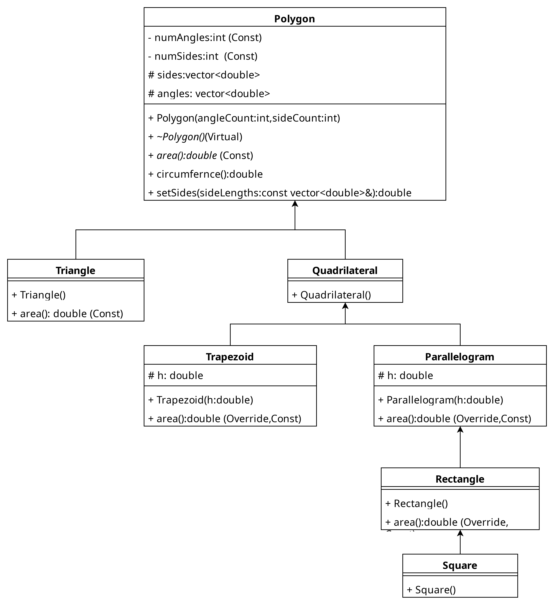

# المحاضرة 11
## الوراثة بالأمثلة - 2 -
### د. أسامه ناصر
2025-2026
---

```yaml
hideInToc: true
```
# الفهرس
<toc mindepth="1" maxdepth="3" />

---

```yaml
hideInToc: true
```
# في الحلقة السابقة
- مثال عن الوراثة بالاعتماد على القوائم
---

# مثال اليوم
- سنعمل في هذه المحاضرة على بناء الشجرة التالية كصفوف:

---

# الصفوف
- لدينا الصفوف التالية:
	- كثير الأضلاع Polygon
	- الرباعي Quadrilateral
	- متوازي الأضلاع Parallelogram
	- شبه المنحرف Trapezoid
	- المستطيل Rectangle
	- المربع Square
	- المثلث Triangle
---

## كثير الأضلاع Polygon
- يمتلك الحقول التالية:
	- numAngles يعبر عن عدد الزواية (ثابت)
	- numSides يعبر عن عدد الأضلاع (ثابت)
	- sides شعاع vector (vector هو نوع من الأنماط الجاهزة ضمن لغة ++C يعبر عن ArrayList) تحتوي أطوال الأضلاع
	- angles شعاع vector يخزن قيم الزواية
- والتوابع التالية:
	- Polygon  البانين يقبل وسيطين عدد الزواية والأضلاع
	- الهادم ~Polygon (الهادم يمكن أن يكون virtual)
	- area تابع virtual لحساب مساحة الشكل
	- circumfernce تابع لحساب محيط الشكل
	- setSides تابع لنسخ قيم أطوال الأضلاع من شعاع لآخر
- ملاحظة:
	- في مخطط الصفوف التابع المكتوب بخط مائل italic (مثل area) هو تابع مجرد abstract / virtual
	- لا يوجد ما يعبر عن const أو override لذلك تم إضافتها يدويًا للمخطط\
---

## الرباعي Quadrilateral
- يعبر عن شكل يمتلك أربع أضلاع
## متوازي الأضلاع Parallelogram
- يمتلك حقل إضافي هو الارتفاع ويعيد تعريف تابع area لحساب المساحة
## شبه المنحرف Trapezoid
- يمتلك حقل إضافي هو الارتفاع ويعيد تعريف تابع area لحساب المساحة
## المستطيل Rectangle
- يعمل على إعادة تعريف التابع area لحساب المساحة
## المربع Square  
- مثل المستطيل تمامًا
## المثلث Triangle
- يقوم بإعادة تعريف تابع المساحة area
---

# الكود
```cpp
class Polygon {
private:
    const int numAngles;
    const int numSides;
protected:
    std::vector<double> angles;
    std::vector<double> sides;
public:
    Polygon(int anglesCount = 0, int sidesCount = 0) 
        : numAngles(anglesCount), numSides(sidesCount), angles(anglesCount, 0.0), sides(sidesCount, 0.0) {
    }
```
- نلاحظ أننا اسندنا قيم للثوابت وقمنا مباشرةً ببناء شعاع الأطوال sides من خلال قيمتين sideCount تمثل عدد القيم والقيمة 0 لوضع كل قيم 0 ضمن المصفوفة وبنفس الطريقة angles
---

```cpp
  virtual ~Polygon() {}

    // Setters to populate sides for calculations
    void setSides(const std::vector<double>& sideLengths) {
        if (sideLengths.size() == sides.size()) {
            sides = sideLengths;
        }
    }
    double circumference() const {
        double total = 0;
        for (double side : sides) {
            total += side;
        }
        return total;
    }
    virtual double area() const {
        return 0.0; 
    }
};
```
---

```cpp
class Triangle : public Polygon {
public:
    // Calling the parent constructor inside the initializer list
    Triangle() : Polygon(3, 3) {}

    // Overriding area using Heron's Formula
    double area() const override {
        double s = circumference() / 2.0; // Semi-perimeter
        return std::sqrt(s * (s - sides[0]) * (s - sides[1]) * (s - sides[2]));
    }
};
```

- نلاحظ آلية استدعاء باني الأب Polygon ضمن الباني الابن Triangle بنفس طريقة اسناد قيم للثوابت (لضمان تنفيذه باني الأب كأول تعليمة ضمن باني الابن) وتمرير القيم 3 للزواية والأضلاع
- آلية مختلفة لحساب المساحة دون الاعتماد على ارتفاع المثلث
---

```cpp
class Quadrilateral : public Polygon {
public:
    // Calling the parent constructor inside the initializer list
    Quadrilateral() : Polygon(4, 4) {}

};
```
- 
- نلاحظ آلية استدعاء باني الأب Polygon ضمن الباني الابن Quadrilateral بنفس طريقة اسناد قيم للثوابت (لضمان تنفيذه باني الأب كأول تعليمة ضمن باني الابن) وتمرير القيم 4 للزواية والأضلاع
---

```cpp
class Parallelogram : public Quadrilateral {
protected:
    double height; 
public:
    Parallelogram(double h = 0.0) : Quadrilateral(), height(h) {}
    void setHeight(double h) { height = h; }
    double area() const override {
        return sides[0] * height;
    }
};
```

- باني متوازي الأضلاع يتقبل فقط وسيط واحد هو الارتفاع، ويتم استدعاء باني الأب أولًا ثم إسناد قيمة للحقل h
- نقطة مهمة آلية استدعاء اسناد القيم للثوابت تستخدم لاستدعاء باني الأب واسناد قيم للحقول العادية والقابلة للتغيير
- تحقيق تابع area لحساب المساحة
- نقطة مهمة
	- في حال كان تابع virtual يمتلك المحدد const يجب أن يتوفر في التحقيق ضمن الابن
---

```cpp
class Rectangle : public Parallelogram {
public:
    Rectangle() : Parallelogram() {}
    double area() const override {
        return sides[0] * sides[1];
    }
};
class Square : public Rectangle {
public:
    Square() : Rectangle() {}
};
```
---

```cpp
class Trapezoid : public Quadrilateral {
private:
    double height;
public:
    Trapezoid(double h = 0.0) : Quadrilateral(), height(h) {}
    void setHeight(double h) { height = h; }
    double area() const override {
        return ((sides[0] + sides[2]) / 2.0) * height;
    }
};
```
---

```cpp
int main() {
    std::cout << "--- Creating Shapes ---\n";
    Triangle myTriangle;
    myTriangle.setSides({3.0, 4.0, 5.0})
    Rectangle myRectangle;
    myRectangle.setSides({5.0, 10.0, 5.0, 10.0});
    Square mySquare;
    mySquare.setSides({4.0, 4.0, 4.0, 4.0});
    Trapezoid myTrapezoid(6.0);
    myTrapezoid.setSides({4.0, 5.0, 8.0, 5.0});
```

---

```cpp
    std::cout << "\n--- Calculating Metrics ---\n";
    Polygon* shapes[] = { &myTriangle, &myRectangle, &mySquare, &myTrapezoid };
    for (int i = 0; i < 4; ++i) {
        std::cout << "Shape [" << i + 1 << "] Circumference: " << shapes[i]->circumference() << "\n";
        std::cout << "Shape [" << i + 1 << "] Area: " << shapes[i]->area() << "\n";
        std::cout << "------------------------\n";
    }
    return 0;
}
```

- نلاحظ قدرتنا على جمع كل الأشكال ضمن مصفوفة واحدة من نوع Polygon (تمثيل الابن بالاعتماد على الأب - تعميم) ما يعرف باسم تعددية الأشكال